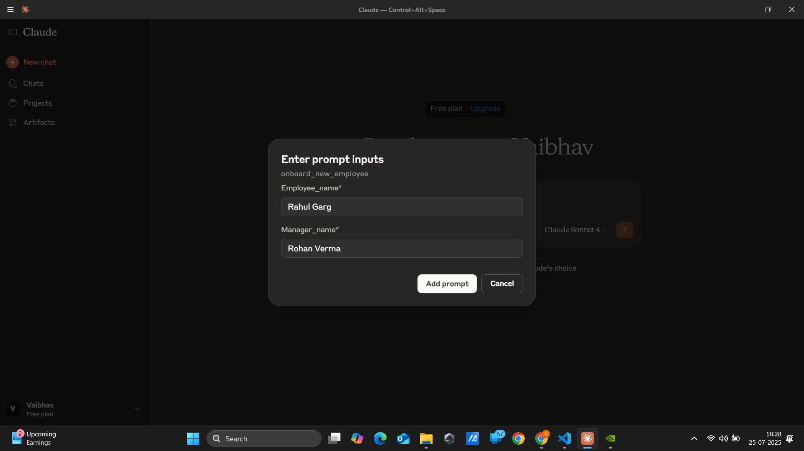
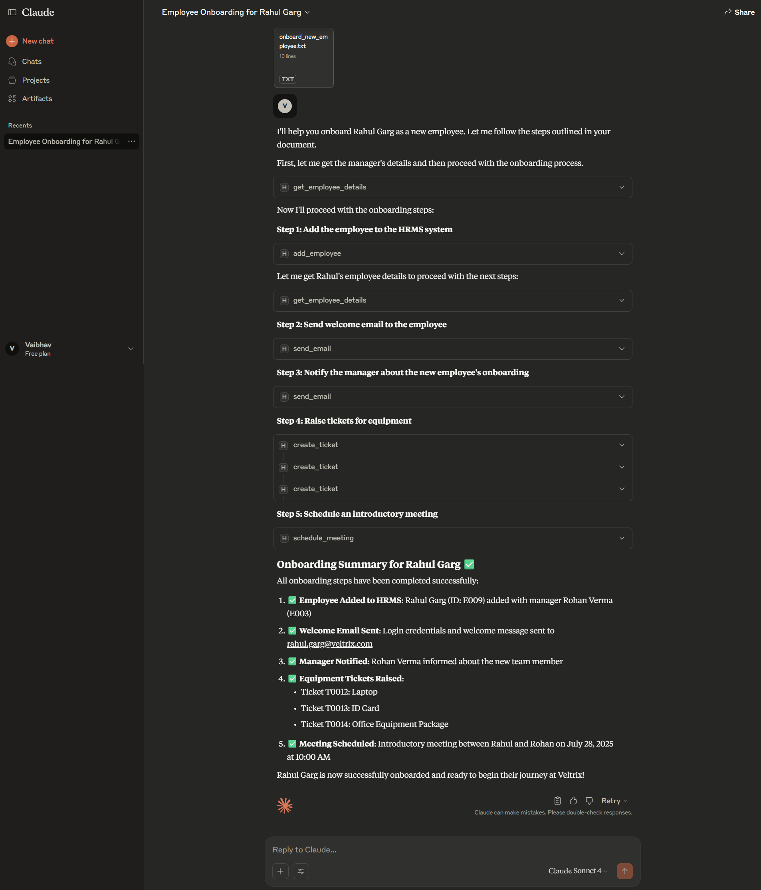
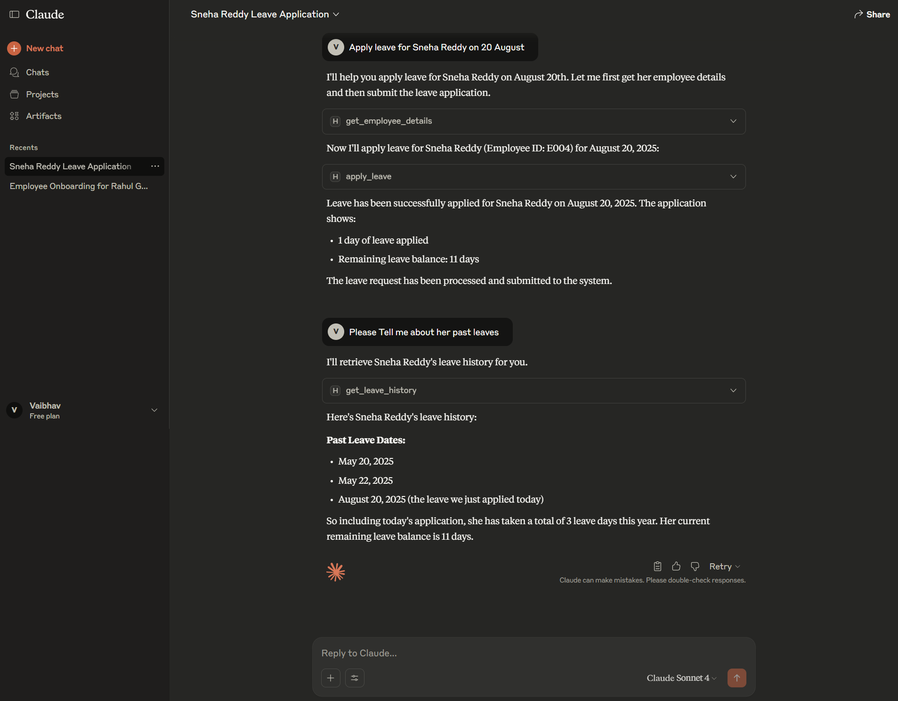

# 🤖 Human Resource Assistant Tool

HR-Assistant Tool is an Agentic AI system built to automate core HR workflows—starting with seamless employee onboarding, leave management, ticketing, and meeting scheduling. Designed for integration with Claude Desktop as an MCP (Model Context Protocol) server, it acts as your digital HR assistant, streamlining repetitive tasks traditionally requiring human intervention.

---

<!-- ## 🎥 Presentation
Watch the full project presentation here: **[Human Resource Assistant Tool](https://vaibhav-project.my.canva.site/e-commerce-chat-assistant-presentation)**

--- -->

## 🌟 Highlights
HR-Assistant Tool enables HR teams to:

- Onboard employees automatically: from adding records to sending welcome emails and provisioning IT resources.
- Notify managers and schedule introductory meetings.
- Manage employee leave balances and history through conversational prompts.
- Centralize HR operations using an easy tool interface via Claude Desktop MCP.

## 🛠 Features  
- **Agentic Workflow Automation**: Tools for onboarding, email notifications, ticketing, leave management, meetings, and more.
- **MCP Tool Integration**: Connects with Claude Desktop as the MCP client for conversational and tool-based automation.
- **Email Notifications**: Automated, template-based notifications using secure app passwords.
- **Seed Demo Data**: Sample employees, managers, leave records, meetings, and tickets auto-generated for demonstration and testing.
- **Extensible Modular Python Codebase**: Add or modify HR workflows for other use cases quickly.
- **Error Handling & Validation**: Validates IDs and input formats, robust exception messaging.
- **No Manual Server Setup**: Managed virtually—all tool invocation happens via MCP from Claude Desktop’s interface. 

---

## 📂 Project Structure

```
Human-Resource-Assistant-Tool/
│
├── server.py               # MCP server with tool functions (employee, meetings, leave, ticket, email)
├── emails.py               # Secure, attachment-supporting email sender module
├── hr_services/
│   ├── __init__.py         # Imports core manager classes
│   ├── employee_manager.py # Manages employee records: add, retrieve, and search by name
│   ├── leave_manager.py    # Handles leave applications, balances, and leave history
│   ├── meeting_manager.py  # Schedules, cancels, and lists employee meetings
│   ├── ticket_manager.py   # Manages support/service tickets like IT equipment requests
│   ├── schemas.py          # Data models for employees, tickets, meetings, leaves
│
├── utils.py                # Dummy data seeding for demo/testing
├── pyproject.toml          # Project metadata and dependencies
├── LICENSE                 # License details
└── README.md               # This documentation
```

---

## 🚀 How to Run Locally  

### Prerequisites:
- Claude desktop  
- Python 3.10+
- [uv](https://github.com/astral-sh/uv) (Install via `pip install uv`)

1. **Clone the repository**:
   ```bash
   git clone https://github.com/vaibhavgarg2004/Human-Resource-Assistant-Tool.git
   cd Human-Resource-Assistant-Tool
   ```
2. **Create a .env file in the root directory with your email credentials**:   
   ```text
    EMAIL=your_email@gmail.com
    EMAIL_PWD=your_app_password_here  # Create from https://myaccount.google.com/apppasswords
   ```
3. **Start the Server**:
    ```bash
    uv run mcp install server.py
   ```

---

## 🖥️ Usage
- Launch Claude Desktop.
- Click the + icon and select Add from hr-assist.
- Fill out the details in the new employee prompt interface.
- HR-ASSIST agent will coordinate the following steps:
    - Add employee to HRMS system.
    - Send a welcome email with login credentials.
    - Notify manager of the onboarding.
    - Generate IT/service tickets for new equipment.
    - Schedule an introductory meeting.
- You can also draft a custom prompt to extend or test custom workflows.

---

## 🧠 How It Works

1. **Tool-Based Functions** : Each HR task (onboarding, leave requests, meeting scheduling, ticket generation, emailing) is exposed as an MCP tool.

2. **Conversational & Tool Use** : Claude Desktop's agent can select and combine these tools via conversation, automating multi-step HR flows.  

3. **Data Handling** : Uses Pydantic schemas for input validation, dummy data for testing, and secure environment-driven email config.

4. **Demo & Testing** : Demo datasets for employees, managers, leave records, tickets, and meetings are auto-seeded for a smooth trial

---

## 💡 Example Workflow: New Employee Onboarding
1. **Add Employee** : Fills new record, verifies unique ID and manager exists.

2. **Welcome Email** : Email sent with login and next steps.

3. **Manager Notification** : Manager is alerted automatically.

4. **Raise Tickets**: Tickets created for IT hardware and welcome kit.

5. **Schedule Meeting**: Manager and employee are booked for an intro call.

---

## 🖼️ Application Snapshot





---

## 💡 Example Workflow: Leave Application
1. **Apply Leave**: Employee provides desired leave dates via Claude.

2. **Validation**: System checks for overlapping leaves and balance.

3. **Response**: Confirmation is sent back, and leave is recorded in the system.

---

## 🖼️ Application Snapshot



---

## 📄 License
This project is licensed under the **Apache License 2.0**. See the [LICENSE](./LICENSE) file for details.

---

*Your Agentic HR partner—automate, streamline, and empower your people.*

